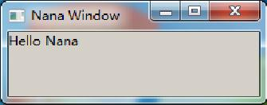
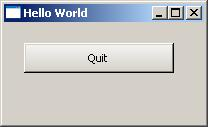
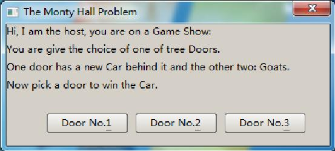
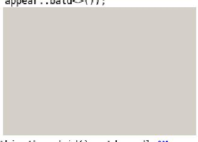
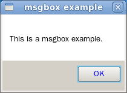
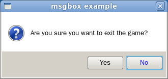

# Getting Started #

See also:
 
 + [An application of Clone Method to Nana C++ Library](http://nanaproject.wordpress.com/2011/03/20/clone_method/) (March 20, 2011 )
 + [An introduction to the image processing interfaces from release of 0.2.2](http://nanaproject.wordpress.com/2012/04/17/an-introduction-to-the-image-processing-interfaces-from-release-of-0-2-2/) (April 17, 2012)
 + [Blending Images](http://nanaproject.wordpress.com/2012/02/22/blending-images/) (February 22, 2012)
 + [Introduction to The Support of Bidirectional Language](https://nanaproject.wordpress.com/2012/06/18/introduce-to-the-support-of-bidirectional-language/) (June 18, 2012)
 + [Nana Tutorial: Creating A GUI Calculator ](https://sourceforge.net/p/nanapro/blog/2013/03/nana-tutorial-creating-a-gui-calculator/) (2013-03-03 ) 
 + [The FreeMe](http://nanapro.sourceforge.net/help/tutorials/thefreeme.htm)
 + Demo of Nana C++ Library
 + See the examples in this documentation.

\tableofcontents

\section exam Examples

This chapter shows how to create an small graphical user interface (GUI) application with Nana C++ Library. 

\subsection HelloN Hello Nana  

Let's start with a simple program, we will study it line by line. 

\code{.cpp}
	1 #include <nana/gui/wvl.hpp> 
	2 #include <nana/gui/widgets/label.hpp> 
	3 int main() 
	4 { 
	5 	nana::form form; 
	6 	nana::label label(form, nana::rectangle(0, 0, 100, 20)); 
	7 	label.caption("Hello Nana");
	8 	form.show(); 
	9 	nana::exec(); 
	  } 
\endcode

Lines 1 and 2 include the definitions of class `form` and class `label` in namespace `nana`. 
Every GUI application written with Nana C++ Library must include the header file `nana/gui/wvl.hpp`. 

Line 5 defines a `nana::form object`. It is a window used for placing a label widget in this example. 

Line 6 defines a `nana::label` object to display a text string. The label object is created in the form. A widget is a visual element in the user interface. 

Line 7 sets the caption of the label object. Every widget has a caption for displaying a title. 

Line 8 makes the form visible. 

Line 9 passes the control of the application to Nana. At this point, the program enters the event loop for waiting for and receiving a user action, such as mouse move, mouse click and keyboard press. The function `nana::exec` blocks till `form` is destroyed, and what the example demonstrate is that the program exits when a user closes the window. 

Now, you can run the program on your own machine. But firstly you should have Nana C++ Library 
installed in your system. A method to install is explained in [Installation Library Documentation](http://nanapro.org/en-us/help/instl_lib_doc.htm) in Nana Programmer`s Guide or [in the wiki](https://github.com/qPCR4vir/nana-docs/wiki/Installation) 

 

\subsection Event Responding an Event  

The second example shows how to respond a user action. To receive a user action, an event 
handler should be registered to a widget. Nana waits for a user action and invokes the event 
handler of the corresponding event. The example application consists of a button that the user can click to quit. 

\include Examples\helloword_quit.cpp
This source code is similar to Hello Nana, except that we are using a button instead of a label, and 
we are making an event to respond a user click. Every widget class has a set of methods to make events, 
they are named "events()". The parameter of the member function is an 
event handler. As above code shown, we make the `API::exit()` as an event handler for the button's click event. 
The `exit()` function is an API in Nana C++ Library. It closes all windows in current GUI thread and terminates 
the event loop. It will be called when the user clicks the button. 

 
 

\subsection notepad Simple Notepad  
This is an small but working notepad:

\include notepad.cpp
A few comments:  

\dontinclude notepad.cpp

\skipline notepad_form
We need among others to create the `menubar` and `textbox`, and set the layout for the form.

\skip  borderless(true);
\until API::effects_edge_nimbus 
Disables the border and edge numbus effect of the textbox.

\skip  events().mouse_dropfiles
\until });
Sets a Drag'n Drop event for the textbox, it allows user to open a file by dragging the file outside of the program and dropping the file inside the program. 
The call of _m_ask_save() here is to try to ask user to save the edited text.

\skip  events().unload
\until  });
Sets an unload event for the form, it enables program to ask user to save the edited text when closing the program, and if user cancels the messagebox, the program stops closing.

\skipline _m_pick_file
We start with a private member function `_m_pick_file()`, this function is to tell user to select a file.

\skipline return (fbox.show() ?  
If the user clicks the "cancel" button or closes the dialogue by clicking the 'X' close button, `fbox.show()` returns `false` for no file selection.

\skipline _m_ask_save()
This function will have asked user to save the text to a file by the time the text is closed.
 
\skipline (textbox_.edited())
Determines whether the text has been edited. If there are modifications to the text, then it ask to save it.

\skipline  textbox_.filename
When the textbox opens a file or saves a text to a file, the textbox will keep the filename. If `fs` is empty, the program asks user to select a file to save the text. `_m_ask_save()` has a return type `bool`. It returns `false` if and only if the user cancel the selection.

\skipline _m_make_menus()
Sets menus for the menubar.

\skipline main
Creates the form of notepad.
 
 
\section Functor Function Objects  

This chapter shows two basic concepts: function objects and lambdas.
A Function Object, or Functor (the two terms are synonymous) is simply any object that can be called as if it is a function. It can be an object of a class that defines a member function `operator()`.

The function object is an impressive technology. A function object is a more general concept than a function because a function object can have state that persist across several calls and can be initialized and examined from outside the object, unlike a static local variable. For example:

\code{.cpp}

	class sum 
	{ public: 
		sum() : i_(0) {} 
		operator int() const volatile { return i_; } 
					   //this makes the objects of this class can be used like a function. 
		void operator()(int x) volatile { i_ += x; } 
	  private: 
		int i_; 
	}; 

	void foo(const std::vector<int>& v) 
	{ 			//gather the sum of all elements. 
	   std::cout<<std::for_each(v.begin(), v.end(), sum())<<std::endl; 
	} 
\endcode

`std::for_each()` returns a copy of the object `sum`, and we are able to retrieve the state or result. 
On the basis of the feature that function objects retain its own state, it is easy used for concurrency process, and it is extensively used for providing flexibility in the library implementation.

Nana C++ Library uses a large number of function objects to make the framework work. To make the framework flexible enough, Nana C++ Library uses the general std::function class template.

There are four different types of event handlers that can be processed. It is flexible and reduce the complexity of study and use. 

In the previous example, we illustrated the use of std::function and the flexibility of using a 
function object. Practically, creating a functor object is not required. Using these 
functions this way instead of creating a functor: ?????

\code{.cpp}
	int main() 
	{ 
		using namespace nana; 
		form fm; 
		click_stat cs; 
		fm.events().click(foo); 
		fm.events().click(cs, &click_stat::respond); 
		fm.events().click(foo_with_eventinfo); 
		fm.events().click(cs, &click_stat::respond_ei); 
		fm.show(); 
		exec(); 
	} 
\endcode
![Figure 2.1 Various methods to make events to respond click.] (make_event.jpg)

Or  more elaborated:
\include C:\Prog\ExtLib\nana-demo\Examples\various_events.cpp

\subsection Predefined Predefined Function Objects (is this in use?)

Nana C++ Library includes many different predefined function objects. Using these 
function objects together with function templates increases the expressive power of 
the library as well as making the resulting code much more efficient. For example, if
a C++ program wants to close the form when the form is being clicked. 

\code{:CPP}
	form.events().click(destroy(form)); 
\endcode

Please include <nana/gui/functional.hpp> before using these function objects. 

\code{:CPP}
	class destroy 
	{ public: 
		destroy(nana::window wd); 
		void operator()() const; 
	}; 
\endcode

Destroy the window. 

\code{:CPP}
	class hide 
	{ public: 
		hide(nana::window wd); 
		void operator()() const; 
	}; 
\endcode

Hide the window.
 
\code{:CPP}
	class show 
	{ public: 
		show(nana::window wd); 
		void operator()() const; 
	}; 
\endcode

Show the window. 

\subsection Lambda The Lambda Expression 

A lambda expression is a mechanism for specifying a function object. The lambda 
is a new feature that introduced into C++ language recently, the primary use for a 
lambda is to specify a simple action to be performed by some functions. For example: 

\code{:CPP}
	#include <nana/gui/wvl.hpp> 
	#include <iostream> 
	int main() 
	{ 
		nana::form form; 
		form.events().click( 
			[]{ std::cout<<"form is clicked"<<std::endl; } 
			); 
		form.show(); 
		nana::exec(); 
	} 
\endcode

The argument []{ std::cout<<"form is clicked"<<std::endl; } is a "lambda" 
(or "lambda function" or "lambda expression") in C++11 language. A lambda starts with plain [],
and compound-state block {} defines a function body. In fact, A lambda defines an anonymous 
function object, and therefore a lambda could be invoked through a function-call syntax. 

\code{:CPP}
	[]{ std::cout<<"hello, Nana"<<std::endl; }(); 
\endcode

The use of lambda is creating an anonymous function object and so the arguments should be specified. For example: 

\code{:CPP}
	form.events().click( 
			 
			{ std::cout<<"mouse pos=("<<ei.pos.x<<", "<<ei.pos.y <<std::endl;} 
		); 
\endcode

The lambda-declarator () is used like a parameter-list. Let's stop the introduction to the lambda, if you want more details of lambda, please refer to other C++ books. 

\section forms   Creating forms  

This chapter will teach you how to create a window using Nana C++ Library. 
A window is a visual element in the operation system or window environment. 
Form is a window that like a container can contain other widgets, such as button, 
textbox and listbox. Every GUI program created with the Nana C++ Library need to create one 
form at least, as in examples of chapter 1. Many forms are created by creating an instance of form. 
This way of creating a form is easy, but it will make your program complicated if you want to create a bit larger program.
 
\subsection der Defining a form through Derivation  
Nana C++ Library is implemented using Object-oriented methods. We can define an own form by deriving from nana::form. 

Our first example is a Monty Hall Problem. This is a game that tests you whether change your choice after you picked a door to win a new Car. 

 

Let's start creating this application. First we are going to design architecture for the application. 
As we saw in figure 3.1, the application needs a form, a label and three buttons. 

\includelineno MontiHall.cpp
\notinclude MontiHall.cpp
Lines 1 to 4 include the headers that are required by this application. 
The `wvl.hpp` provides the basis of Nana C++ Library that all GUI program required. `label.hpp` 
and `button.hpp` include the definitions of label and button, and we will specify the door which 
has the new Car randomly by using `timestamp()` - function provided in `platform.hpp`. 

Lines 6 to 21 define the class `monty_hall` derived from nana::form. In other words, class `monty_hall` is defined as a `form` and we will put all handlers in this class scope to keep the program clear. 

Line 9 defines a state type that contains three states. `state_begin` is a state that indicates 
the first pick, `state_picked` indicates the second pick, and `state_over` indicates the result. 

Line 11 declares a default constructor. It will initialize the widgets and set the initial state. 

Line 13 declares a private member function to respond the user action on buttons. 

Line 14 and 15 declare two private member functions which handle the game logic. We will define them later.
 
Lines 17 to 20 define the data members including label and buttons. The integer member door_has_car_ indicates the number of the door which has a car behind it.
 
Lines 23 to 28 define the main function; an object of class monty_hall is defined, sets the form visible and enters the event loop.
 
Let see the default constructor and three private member functions. 

Line 30 and 31 initialize the base class of monty_hall. make_center() is a function that returns 
a rectangle that specifies an area in the center of screen with size of 400 X 150. The typedef name 
appear is used for the abstraction of form appearance. The appear::decorate defines the form with caption 
bar, border, a close button and displaying in taskbar. 

Line 17 initializes the state. 

Line 33 sets the caption of form. 

Lines 34 to 37 define a text that describes the game information. 

Line 39 and 40 create a label widget and set the caption of label. The label will display the text which is defined in line 34. 

Line 41 and 42 define a string array which contains the names of three doors. 

Lines 43 to 48 create the buttons in a loop, and set the caption, make a click event for three buttons. 

On line 51, the member function has a parameter, eventinfo that contains the event 
information, such as which widget the event is taking place. We need the information to 
determinate which button is clicked, because the event handler of the three buttons is one 
and the same. 

Lines 53 to 59 find the index of the button which is clicked. The button which is click is specified by ei.window. _m_play() handles the logic of game. 

Line 60 defines the _m_play() to handle the logic of this game, it contains a parameter to indicate 
what the number of door is picked. There are two states we would handle, state_begin indicates the 
first pick, and now, program should put the car behind a door randomly, use the timestamp() function 
to retrieve the number of milliseconds that have elapsed since system was started, we use the number 
to implement randomization, and find the remainder of division of the number by 3 through the modulus 
operation, the last result is the door number which is large or equal to 0 and less than 3. _m_remove_door() 
is used for removing a door excluding the car behind it and the door that is picked. 

Line 67 is setting the next state. 

Line 69 is start of handling the state that gamer plays the second pick. 

Line 70 and 71 test the number of door whether is the door which the car behind it, and set the caption of label by result. 

Line 72 sets the final state. 

In fact, in the lines from 51 to 59, the member function _m_pick_door() can be removed by using 
std::bind(), refer to section 2.3 Think about the Design. By using std::bind(), we can bind the 
the index of door to the _m_play() and make it as the event handler for the click of button. 

Line 74 defines the _m_remove_door() to removes a door which is a goat behind it and 
is not picked by gamer. The parameter exclude is a door number that picked by gamer. 

Lines 76 to 80 create a std::vector object that contains the index of doors excluding 
the one of gamer picked. So the result of vector only contains two doors. 

Lines 81 to 85 choose a door in the vector randomly, if the door has a car behind it, 
change the choice to other one, the door which is chosen will be removed. A widget has two methods named enabled(), they are overloading functions void enabled(bool) and 
bool enabled() const, are used for setting or retrieving the state whether the widget can 
receive inputs from mouse and keyboard. If the enabled state of a button is set to false, 
the color of button text becomes gray and the button is not working while clicking on it. 

Lines 86 to 97 prepare the text that asks gamer whether changes his choice after the first pick.
 
Now run the program. Verify that the shortcut keys Alt+1, Alt+2 and Alt+3 trigger the correct behavior. 
Press Tab key to navigate through the buttons with keyboard, the default tabstop order is the order in which the buttons were created. 

\subsection loader Creating An Instance of the Form with form_loader<form>()  

In the previous chapters we provided examples of defining the form objects. 
They are usually local objects. When the local object goes out of scope, its destructor is called automatically. 
Sometimes we need to keep the object alive when it goes out of the scope: another way to create an object is to declare 
a pointer variable to the class of object and call the C++ new operator, which will allocate space for the object 
and call the constructor. In this case, the pointer variable must be explicitly deallocated with the delete operator. 
But the question is when shall we delete the pointer variable? In fact, we can create a form object by using form_loader. 
Nana C++ Library will manage the form objects created by form_loader and destroy the objects when the user closes the form. For example:

\include loader_1.cpp
nana::form_loader is a template functor class. It creates an object of the template 
parameter class. nana::form_loader is useful when you create a form and don't want to 
take care about the lifetime of the object. Continuing with the next example, we see a form 
is created when the button is being clicked. 

\include loader_2.cpp
In fact, a form_loader object can be passed to make_event because it is a functor. 
Take a look at above code: form would not be shown immediately after initialization, 
and the show() method is need to call explicitly after creating the form by form_loader. 
Therefore, only an invisible form created by the form_loader object we can get, if we pass 
the form_loader object like above code to the make_event. A way to achieve it is calling the 
show() method in that constructor of class, but in most instances, we are not enable to modify 
the code of the classes, and therefore we need a correct solution. The form_loader has two 
template parameters, the first is used for specifying a type of form, the second is a non-type 
template parameter and its type is bool named IsMakeVisible, used for determining whether making 
the form visible. So, we can specify the second template parameter by giving true, like this. 

\code{.CPP}
	btn.events().click(form_loader<form, true>()); 
\endcode

See also [this discussion](https://nanapro.codeplex.com/discussions/443128).

\subsection mmodal Modal Form  

Modal form is a modality of forms. It would handle all interactions with the user 
while the form is active. This is what makes the form modal, the user can not interact 
with its owner window until the form is closed. Modal form is useful to block the program 
execution and wait for a user input. For example:

\ include modal_form.cpp
Call nana::API::modal_window() to enable modal form. Only if an owner is 
specified for the form initialization, will the form enable as modal form. The 
object fm in function foo() is created and specified ei.window as its owner. The 
ei.window refers to the form that is defined in function main(), and passed by event argument. 

\section appear_doc Appearance of Window 

A window has an appearance. This appearance can be specified when a window is being created. 
To determine the appearance of a window there is a structure named nana::appearance with 
a bool member for each feature with can be included or excluded in the "apereance" of the windows form. 
But in practical development is hard to describe the style of the appearance using the struct nana::appearance.
If a form would to be defined without min/max button and sizable border, then

\code{.CPP}
    nana::form form(x, y, width, height, nana::appearance(false, false, false, true, false));
\endcode

This piece of code may be confusing because of the 5 parameters of the constructor of `nana::form`. So the library provides a helper class for making it easy.  
For better readability and understandability Nana provides three templates classes to generate an appearance object: 
nana::appear::decorate, nana::appear::bald and nana::appear::optional. Each provide an operator 
that return a corresponding nana::appearance with predefined values. 
 
\code{.CPP}
namespace nana {
	struct appear 
	{ 
		struct minimize; 
		struct maximize; 
		struct sizable; 
		struct taskbar; 
		struct floating; 
		struct no_activate; 
		template<   typename Minimize = null_type, 
					typename Maximize = null_type, 
					typename Sizable = null_type, 
					typename Floating = null_type, 
					typename NoActive = null_type   > struct decorate; 
		template<   typename Taskbar = null_type, 
					typename Floating = null_type, 
					typename NoActive = null_type, 
					typename Minimize = null_type, 
					typename Maximize = null_type, 
					typename Sizable = null_type   > struct bald; 
		template<   bool HasDecoration = true, 
					typename Taskbar = null_type, 
					typename Floating = null_type, 
					typename NoActive = null_type > struct optional; 
	}; }}
\endcode

These templates generate appearances. Every template receives the template parameters for specifying the attributes of the appearance. 

__template nana::appear::decorate__ is used for creating an appearance of a window with "decoration". 
A window decoration in Windows is called the non-client area, such as title bar.

We can create a form without min/max button and sizable border like this:  
\code{.CPP}
using nana::appear;
nana::form form(x, y, width, height, appear::decorate<appear::taskbar>());
\endcode

![Decoration appear::decorate<>() - generating an appearance with a border and titlebar] (Decoration.jpg) 

The appearance created by appear::decorate<>() has a titlebar and borders that are draw by the platform- window manager. 
If a window needs a minimize button, it should be:
\code{.CPP}
appear::decorate<appear::minimize, appear::taskbar>()
\endcode

__nana::appear::bald__ is used for creating a window without decoration. 

 

The appearance created by nana::appear::bald<>() has no titlebar and no 3D-look borders. 

The appearances of these figures were created by templates without specifying the template parameters. 
Each template provides some parameters, and each template parameter name indicates what attribute is supported
by the template. For example template nana::appear::decorate receives the parameters nana::appear::minimize, appear::maximize, 
appear::sizable, appear::floating and appear::no_activate. So, creating an appearance with decoration 
that has a minimize button and maximize button will be: 

\include decore.cpp
![Decoration with minimize button and maximize button] (minimize.jpg)

__The nana::appear::optional__ is used to create a window with decoration depending on the first non-type template parameter.

There is a feature for these templates: the order of template parameters does not affect 
the order of explicit specifying template parameters, the name of template parameters just 
tell you which attribute can affect the appearance. For example: 

nana::appear::decorate<appear::minimize, appear::maximize>() creates an appearance that is the same as the result 
created by nana::appear::decorate<appear::maximize, appear::minimize>().
 
nana::appear::decorate<>() creates an appearance that is the same as nana::appear::decorate<int, int, int, int, int>(), 
because the type of int is not wanted. 

The parameter of class template nana::appear::decorate can be minimize, maximize, sizable, taskbar, floating.

The parameter of class template nana::appear::bald     can be taskbar, floating.

The parameter of class template nana::appear::optional can be true, false, taskbar, floating.

\section event Event Handling  

Event is a messaging mechanism provided by the window system. Various kinds of 
events are generated by the window system for notifying the application. A key or 
mouse event is generated when the user presses or releases a key or mouse button, 
and the application can receive the event and response to user actions. 

The different window systems provide their own patterns of messaging mechanism. Nana 
implements an abstract pattern of event mechanism to hide the difference between different window systems. 

\subsection reg Registering and Unregistering an Event  

To response to the click action generated by any specified button, we need to make the click event for the button. 

\code{.cpp}
#include <nana/gui/wvl.hpp> 
#include <nana/gui/widgets/button.hpp> 

void foo() { } 

int main() 
{ 
    using namespace nana; 
    form fm; 
    fm.events().click(foo); 
    exec(); 
} 
\endcode

As shown in above code, the `event()` is a member template of class widget, and it is 
used for registering an event handler. The above code makes a click event for the `form` object.
When the user clicks the body of the form, Nana is responsable for invoking the function `foo()` 
registered as a handler of the specified event. Additionally, the function `foo()` can be 
specified with a parameter of type `const nana::arg_mouse&` to receive the information 
of the event. See details of `eventinfo` are described in section 6.2. 
\see 

The `event()` returns a handle of event handler if the registration is successful. 
The type of the return value is nana::event_handle. With this handle, we can delete the event handler manually. For example:

\code{.cpp}
	event_handle handle = fm.events().click(foo); 
	fm.umake_event(handle); 
\endcode

After calling the umake_event(), the `foo()` function would be not invoked when the user clicks the body of form. 
In most situations, we don't need to take care of deleting the event handler, because the event handlers will be deleted when the form is closed. 

\subsection eve Events 

An event type describes a specific event which is generated by Nana. For each event type, 
a corresponding class is defined by Nana, which is used for referring to an event type. 
The classes for event types are defined in the namespace nana, such as `click`, `mouse_move` and so on. 

Every event contains some information. The information is sent to the application through a (const) reference to an `eventinfo` object in event handler. 

\code{.cpp}
	#include <nana/gui/wvl.hpp> 
	void foo(const nana::arg_click& ei) 
	{ 
		//Refer to ei for information of event. 
	} 
	int main() 
	{ 
		using namespace nana; 
		form fm; 
		fm.events().click(foo); 
		fm.show(); 
		exec(); 
	} 
\endcode

Nana.GUI provides some raw events, such as `click`, `mouse_move` and so on. 
Most of these events can work with all widgets implemented by Nana.GUI, but some of them are individual, 
like `unload` for `root widget` and `elapse` for `timer`.

Every widget has an interface for registering an event, named `events()`.    \todo Actualize events and arg!

The events are:

Event	     	    | argument	|	Description
--------------------|----|-----------------------------------
nana::general_events::click		    | nana::arg_click	| A mouse click event.
 dbl_click	    | nana::arg_mouse	| A mouse double click event.
 mouse_enter	| nana::arg_mouse	| A mouse enters a widget.
 mouse_move	| nana::arg_mouse	| A mouse moves over a widget.
 mouse_leave	| nana::arg_mouse	| A mouse leaves a widget.
 mouse_down	| anana::rg_mouse	| A mouse button is pressed on a widget.
 mouse_up	    | nana::arg_mouse	| A mouse button is released on a widget.
 mouse_wheel	| nana::arg_wheel	| A mouse scrolls the wheel on a widget.
 mouse_dropfiles	| nana::arg_dropfiles	| A mouse release over a window that is registered as recipient of drag and drop.
 expose        | nana::arg_expose | the visibility changes
 resizing	    |  nana::arg_resizing | A widget's size is changing.
 resized       |  nana::arg_resized  | A widget's size changed.
 destroy		| nana::arg_destroy	| The window is destroyed, but occurs when all children have been destroyed
 focus		    | nana::arg_focus	| A widget's focus is changed.
 key_press     | nana::arg_keyboard | a key is pressed while the window has focus. event code is event_code::key_press
 key_release   | nana::arg_keyboard | a key is released while the window has focus. event code is event_code::key_release
 key_char	    | nana::arg_keyboard | a character, whitespace or backspace is pressed. event code is event_code::key_char. The nana::focus widget received a character.
 shortkey	    | nana::arg_keyboard	| a defined short key is pressed. event code is event_code::shortkey. The widgets received a shortkey message.
nana::move          | nana::arg_move  | the window changes position

\deprecated  ?
 elapse		|	| A widget received a tick that is sended by timer.
 unload		|	| A form is closed by clicking the X button, only works for root widget.
 key_up		|	| A keyboard is released on a focus widget.
 key_down	|	| A keyboard is pressed on a focus widget.

				
An user-defined event function may have a parameter of type `const nana::event_arg&` for queering the event information, such as mouse position.

\code{.cpp}
	void foo();
	void foo_with_parameter(const nana::arg_click&);
	class user_def_functor
	{ public:
	   void operator()(const nana::arg_click&); 		 //user-defined function must have the parameter.
	};
	nana::button().events().click( foo                );
	nana::button().events().click( foo_with_parameter );
	nana::button().events().click( user_def_functor{} );
\endcode

`events()` members like click() returns a handle for uninstalling the associated user-defined event function and Nana.GUI destroys the user-defined event function automatically when the widget is beginning to destroy.

This just describes these raw events, but some widgets like nana::treebox provides some high-level events, 
such as expanding a node. These details are only described in its reference. 

For different events, the `eventinfo` contains different structures for these event types. The following paragraphs describe the details of eventinfo. 

\subsubsection mous Mouse Events  
The mouse is an important and convenient input device. The user controls the mouse cursor 
on the screen through moving and clicking mouse. If the mouse cursor moves over on a widget, 
the system would generate a `mouse_move` event to notify the program to which the widget belongs. 
The structure of mouse events contains: 
\code
	struct implemented-specified 
	{ 
		short x; 
		short y;            //point (x, y) coordinates in event widget 
		bool left_button;   //True if the left button is pressed. 
		bool mid_button;    //True if the middle button is pressed. 
		bool right_button;  //True if the right button is pressed. 
		bool shift;         //True if the shift key is pressed. 
		bool ctrl;          //True if the ctrl key is pressed. 
	}; 
\endcode
The structure of mouse wheel event contains: 

\code
	struct implemented-specified 
	{ 
		short x; 
		short y;            //point(x, y) coordinates in event widgets. 
		bool upwards;       //True if the wheel is upward rolls. 
		bool shift;         //True if the shift key is pressed 
		bool ctrl;          //True if ctrl key is pressed. 
	}; 
\endcode

In an event handler function, we can refer to the structure by using eventinfo object. For example: 

\code
	void foo(const nana::eventinfo& ei) 
	{ 
		using namespace nana; 
		switch(ei.identifier) 
		{ default: ei.mouse;           //refers to the structure of mouse events. 
				 break; 
		case events::mouse_wheel::identifier: 
				ei.wheel;           //refers to the structure of mouse_wheel event. 
				break; 
		} 
	} 
\endcode

To receive a mouse event, register the event with a specific class which is defined in namespace nana::events. 

	click/dbl_click 

When the user clicks mouse and the mouse cursor is in a widget, the widget receives a click event that is generated by Nana. 

	mouse_enter/mouse_move/mouse_leave 

This event is sent to a widget when the mouse cursor enters/leaves the widget. 

	mouse_down/mouse_up 

This event is sent when the user presses/releases/moves the mouse while the mouse cursor is in a widget. 

\subsubsection Keyboard Keyboard Events  

There are three different kinds of keyboard events in Nana C++ Library: key down, key up and character key down. 

A window system usually uses an input focus to represent a window which would receive the keyboard events. 
In general, a window which user clicks would be set to the input focus widow in Nana C++ Library. 
Additionally, the program can determinate which window gets the input focus by calling `nana::API::set_focus()` .
 
The structure of keyboard event contains:
 
\code
	struct implemented-specified 
	{ 
	  mutable nana::char_t 	key; 
	  mutable nana::bool 	ignore; 
	  unsigned char 		ctrl; 
	}; 
\endcode

As the definition shown, the member `key` and `ignore` are defined as `mutable`, the feature will be explained later. 

	key_down/key_up 

When the users hit the keyboard, the `key_down` would be generated when a key is pressed down, and the `mouse_up`
would be generated when the pressed key is released. 

	key_char 

The `key_char` event is an abstract event. A window system usually translates the keys into characters. For example, to type a 
Chinese character one usually needs to hit in the keyboard more than one key and the window system translates these keys into a Chinese 
character and then a `key_char` event is generated and sent to the program. 
The two members, `key` and `ignore`, are defined as `mutable` in the structure of key event. It is used to modify the state of `key_char` event. 
During `key_char` processing, if the member `ignore` is set to `true`, Nana will igore the key. For example, when a program is designed 
to receive the number input, the program should test the key in key_char event, and set the `ignore` to true if the input char is not a digital.
Likein the  below code: 

\code
	void only_digital_allowed(const nana::eventinfo& ei) 
	{ 
		ei.ignore = (ei.key < '0' || ei.key > '9'); 
	}
\endcode

\section PNG Enable the PNG support for Nana C++ Library

In the release of 0.2, Nana provides the support for PNG, but by defaul Nana disables the feature 
of PNG for easy and fast configuration.
The support for PNG is introduced to Nana C++ Library by employing [libpng](http://www.libpng.org), there are two strategies for the support:
1. use the libpng bundled with Nana;
2. use the libpng from operating system, it means that we have to install the libpng by ourselves.

\subsection pnge Enable the support for PNG

Open the config.hpp in nana include folder, you can find a line of comment like is

	//#define NANA_ENABLE_PNG

Cancel the comment to enable the support for PNG.
Now, the result looks like this:

\code
	#define NANA_ENABLE_PNG 1
	#if defined(NANA_ENABLE_PNG)
	//Comment it for using the libpng from operating system.
	#define NANA_LIBPNG 1
	#endif
\endcode

Keep the #defined NANA_LIBPNG for using the `libpng` bundled with Nana.
Comment it for using the libpng from operating system.
By default, Nana uses the libpng bundled with it in win32 package, and the libpng 
from operating system in linux X11 package.
After configuration, rebuild the Nana C++ Library, and create an application for trial.

\code
	#include <nana/gui/wvl.hpp>
	#include <nana/gui/widgets/picture.hpp>
	#include <nana/gui/layout.hpp>
	int main()
	{
		using namespace nana;
		form fm;
		picture pic(fm);
		gird gd(fm);
		gd.push(pic, 0, 0);
		pic.load(STR("a_png_file.png"));
		fm.show();
		exec();
	}
\endcode

Under Windows, link the static library of libpng in "%nana%/extrlib" folder.

libpng.a: For Dev-C++ and Code::Blocks

libpng.md.lib/libpng.md.x64.lib: For VC and Multi-threaded DLL runtime library.

libpng.mt.lib/libpng.mt.x64.lib: For VC and Multi-threaded runtime library.

Under Linux, modify the makefile and add a "-lpng" for compiler.

\section msg Message box

The `class nana::msgbox` is used for displaying a modal dialog box to prompt a brief message. A brief example.

\code
	nana::msgbox m(STR("msgbox example"));
	m<<STR("This is a msgbox example.");
	m();
\endcode

The msgbox is a C++ stream style, so we can easy to display strings, numbers and all the objects 
whose type overloads an operator<<() for std::ostream.
Sometimes, the application should ask user for a decision, for example, ask user whether to exit.

\code
	void when_exit(const nana::arg_unload& ei)
	{
		nana::msgbox m(ei.window, STR("msgbox example"), nana::msgbox::yes_no);
		m.icon(m.icon_question);
		m<<STR("Are you sure you want to exit the game?");
		ei.unload.cancel = (m() != m.pick_yes);
	}
	int main()
	{
		using namespace nana::gui;
		form fm;
		fm.events().unload(when_exit);
		fm.show();
		exec();
	}
\endcode

\section icon Window Icon
There are two interfaces to set an icon for a window which is a root_widget, such as form 
and nested_form, thay are defined in namespace nana::API.

\code
	void window_icon_default(const nana::paint::image&);
	void window_icon(nana::window, const nana::paint::image&);
\endcode

window_icon_default() sets a default icon, and after calling it, all windows will set 
the default icon automatically while they are creating.
Although the Nana C++ Library is aimed for cross-platform, there is a distinction in Nana 
between Windows and Linux(X11). The icon of a window only could be an ICON file in Windows. 
If cross-platform is desired, the code should be treated differently.

\code
	using namespace nana;
	form fm;
	#if defined(NANA_WINDOWS)
	API::window_icon(fm, nana::paint::image(STR("icon.ico")));
	#else
	API::window_icon(fm, nana::paint::image(STR("icon.bmp")));
	#endif
\endcode

Under Windows, the icon of window is the icon of exe file usually, the icon file is 
stored in the exe file as a resouce. To set the icon resouce for the window, we just 
open the exe with class image in this way.

	API::window_icon_default(nana::paint::image(STR("program.exe")));

or

	API::window_icon(a_form_object, nana::paint::image(STR("program.exe")));

Posted in Nana C++ Library | Tags: c++, Cross-platform, gui, nana

