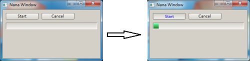
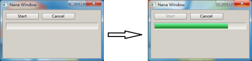
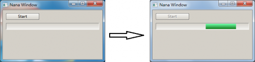

#  Advanced topics 
[TOC]
\section desing  Think about the Design  
Assuming the design of a framework that generates some data and it requires a module 
for representing these data in a GUI. In general, we just introduce an interface for outputting these data, for example: 

	struct data { std::string url; }; 

	class uiface 
	{ public: 
		virtual ~uiface() = 0; 
		virtual void create_ui_element(const data&) = 0; 
	}; 

	uiface::~uiface(){} 

	class framework 
	{ 
		uiface *        uiface_{}; 
		std::vector<data> cont_; 
      public: 
		framework() 
		{ 
			data dat; 
			dat.url = "stdex.sf.net"; 
			cont_.push_back(dat); 

			dat.url = "nanaproject.wordpress.com"; 
			cont_.push_back(dat); 
		} 
		void set(uiface * uif) { uiface_ = uif; } 

		void work() 
		{ if(uiface_) 
		    for(auto & ui_el : cont_ ) 
			  uiface_->create_ui_element(ui_el); 
		} 
	}; 

Now we need a GUI that will create some buttons for representing the data. When a button 
is clicked, it outputs the data that the button represents. Let’s define a GUI for that requirement.
 
	namespace ui 
	{ 
		using namespace nana; 
		class bar : public form, public uiface 
		{ 
			using btn_pair = std::pair<std::shared_ptr<button>, data> btn_pair; 
          	place plc_; 
			std::vector<btn_pair> ui_el_; 

          public: 
			bar() { plc_.bind(*this); plc_.div("<verical abc gap=3>");} 

		  private: 
				   //Now we implement the virtual function declared by uiface 
			void create_ui_element(const data& dat) override
			{ 
				btn_pair p(std::shared_ptr<button>(new button(*this)), dat); 
							  //Make the click event 
				p.first->events().click(  [&](const arg_mouse& ei){_m_click( ei);} ); 
				p.first->caption(nana::string(charset(dat.url))); 
				plc_["abc"]<< *(p.first); 
                plc_.collocate();
				ui_el_.push_back(p); 
			} 

			void _m_click(const arg_mouse& ei) 
			{ 
				//Check which button is clicked 
				for(btn_pair &bp : ui_el_) 
				{ if(bp.first->handle() == ei.window) 
				  { 	//Show data bp.second; 
					std::cout<<"open "<<bp.second.url<<std::endl; 
					break; 
 				  } 
				} 
			} 
		}; 
	} 

The implementing of the GUI is done. Let's make the framework work. 

	#include <nana/gui/wvl.hpp> 
	#include <nana/gui/widgets/button.hpp> 
	#include <nana/gui/layout.hpp> 
	#include <iostream> 
	include definition of framework... 
	int main() 
	{ 
		ui::bar bar; 
		bar.show(); 
		framework fw; 
		fw.set(&bar); 
		fw.work(); 
		nana::exec(); 
	} 

Run the program. Refer to figure 2.2, when we click a button, the program would output the data that is represented by the button. 

![Figure 2.2 Design of a framework] (framework.jpg)
 
Let's rethink the implementation of the class `bar`. It is a bit complicated, because a check of 
which button is clicked is needed. In fact, we can reduce the complexity of the previous design 
by employing function object. Think about the following implementation. 

	class bar : public form, public uiface 
	{   struct command 
		{  data dat; 
		   command(const data& d): dat(d) {} 
			void operator()() { std::cout<<"open "<<dat.url<<std::endl; } 
		}; 
        place plc_; 
		std::vector<std::shared_ptr<button> > ui_el_; 
	  public: 
		bar() { plc_.bind(*this); plc_.div("<verical abc gap=3>");} 
	  private: 
							//Now we implement the virtual function declared by uiface 
		void create_ui_element(const data& dat) override 
		{ 
		  std::shared_ptr<button> p(new button(*this)); 
										 //Make the click event 
		  p->event().click( command(dat) ); 
		  p->caption(nana::string(chartset(dat.url))); 
		  plc_["abc"]<< *p; 
          plc_.collocate();
		  ui_el_.push_back(p); 
		} 
	}; 

As you see it, the new implementation is more convenient. The check of which button is clicked 
and the pair structure are removed. In C++11, the standard library provides a bind function. 
Generating a function object by using std::bind() instead of giving a explicit definition of 
a class that used for a function. Let's remove the definition of struct bar::command and reimplement 
the create_ui_element(). 

	void create_ui_element(const data& dat) override 
	{ 
		std::shared_ptr<button> p(new button(*this, nana::string(chartset(dat.url)))); 
		 //Make the click event 
		using fun = std::function<void()>; 
		p->event().click( fun (std::bind( &bar::_m_click, this, dat) )); 
		plc_["abc"]<< *p; 
        plc_.collocate();
		ui_el_.push_back(p); 
	} 
	void _m_click(const data& dat) 
	{ 
	   std::cout<<"open "<<dat.url<<std::endl; 
	} 

The member function `_m_click()` is very tiny, we can remove it with lambda expression in C++11. 

The main idea of this section is binding the execution context at some place in code 
and retaining the context for future use. As the above code shown, we bind the data with a 
function object, and when the function object is called, we could easily refer to the data. 
By using the reasonable technical idioms, we can make the code more slighter, more expressive, 
the benefits are: flexible application, less comment and easy maintenance. 

\section impl_b   How to implement a button  

\subsection  intro 1 Introduction  
This article explain how to implement a button widget and some basic knowledge about `nana::button`. 
It is a simple widget and a good start point to learn the implementation of a widget. The implementation 
of `nana::button` is defined in *"include/nana/gui/widgets/button.hpp"* and *"source/gui/widgets/button.cpp".*

Nana.GUI provides the framework for implementing a widget. A GUI-widget is made of a window manipulator and a 
drawer trigger, so, to implement a widget we need to implement these two parts. 

_Window Manipulator_

This class provides some operations that make the widget visible for the user. For example `nana::button` is a manipulator. 

_Drawer Trigger_

A drawing operation is driven by the drawer trigger. It provied the internal of a widget, reacting 
to events and is invisible for an user. During the life time of a window manipulator and a drawer 
trigger, Nana.GUI does not involve creation and destruction of a drawer trigger.

\subsection impl 2. Implementation 

\subsubsection manip 2.1 Window Manipulator 

	template<typename DrawerTrigger>
	class basic_button: public widget_object<category::widget_tag, DrawerTrigger>
	{public:
	  basic_button(){}
	  basic_button(nana::widget& widget, rectangle r)
	  { 
        this->create(widget.handle(), r);
	  }
	};

This code defines the window manipulator of the button.

	template<typename DrawerTrigger>

The template parameter `DrawerTrigger` is used to specify a drawer trigger.

`basic_button` inherit from `widget_object<category::widget_tag, DrawerTrigger>`. 
The `widget_tag` indicates the button is a Widget Window. Although all widgets are 
inherited from `nana::widget`, the widgets just can be inherited from the template class `widget_object<>`.

The default constructor does not create the widget unless the `create()` method is called. 
The second constructor will create the widget by calling the `create()` method. Nana.GUI guarantees the safety if an operation is made on a widget before its creation.

\subsubsection trig 2.2. Drawer Trigger  

A drawer trigger is more complicate than a window manipulator; it reacts to mouse and keyboard events. 
In this implementation of the button, the code for drawing the button is written inside the drawer trigger 
directly. Now, let's dip into the definition of the drawer trigger.

A drawer trigger must be inherited from `std::drawer_trigger`.

	using namespace nana;
	class button_drawer: public nana::drawer_trigger<cagetory::widget_tag>
	{public:
		button_drawer ();
		void bind_window(nana::widget & widget);
	 private:
		void attached(nana::paint::graphics &gra ) override;
		void detached() override;
		void normal	(paint::graphics &gra) override;
		void mouse_leave(paint::graphics &gra, const arg_mouse &ei) override;
		void mouse_down	(paint::graphics &gra, const arg_mouse &ei) override;
		void mouse_up	(paint::graphics &gra, const arg_mouse &ei) override;
		void focus		(paint::graphics &gra, const arg_mouse &ei) override;
	 private:
		void _m_draw_title(paint::graphics&, bool is_mouse_down, bool is_focus);
		void _m_draw_background(paint::graphics&, bool is_mouse_down);
		void _m_draw_border(paint::graphics&, bool is_mouse_down);

		nana::widget* widget_ ;
		bool 		is_ms_down_ ;
		bool 		is_focus_ ;
	};

This `button_drawer` makes the constructor and the `bind_window()` member function public, and others private. 

    void bind_window(nana::widget& widget){widget_ = &widget;}

Nana.GUI creates a widget and tells the drawer trigger the widget through `bind_window()`.

The private member functions with don't start with `_m_` are virtual functions that are defined by `nana::drawer_trigger`. 
These virtual functions are invoked inside the Nana.GUI. The name of some of these virtual functions starts with `mouse_` because they are used for answering to mouse operations. You need to override these functions if you want some special capacities.

The private member functions with start with `_m_` are defined by the button drawer trigger. They implements the drawing of the button. As will be readily seen, when a mouse event is raised, the drawer trigger calls these member functions for drawing the widget.

	nana::widget * widget_;

This data member refers to a window manipulator which is connected with the drawer trigger.

	bool is_ms_down_;

This indicates the current status of the left mouse button (is pressed down?).

Now, let's return to the details of the member functions with start with _m_.

	button_drawer::button_drawer()
	:widget_(0), is_ms_down_(false), is_focus_(false)
	{}

The default constructor initializes the data members. `is_ms_down_` will be modified by `mouse_down()` and by `mouse_up()`. `is_focus_` will be modified by `focus()`.

	void button_drawer::set(nana::widget& widget)
	{  if(widget_ == 0) widget_ = &widget;
	}

Sets `widget_`, this function is invoked by the window manipulator's `get_drawer_trigger()`.
The following member functions are the essential part of the drawer trigger.

	void button_drawer::attached(nana::paint::graphics&)
	{
		using namespace nana::API;
		is_ms_down_ = false;
		nana::window window = widget_->handle();
		make_drawer_event<events::mouse_leave>(window);
		make_drawer_event<events::mouse_down>(window);
		make_drawer_event<events::mouse_up>(window);
		make_drawer_event<events::focus>(window);
	}

When a widget is creating, Nana.GUI is responsible for attaching the drawer trigger which is returned 
by the window manipulator to the Window Manager of Nana.GUI. At the same time, Nana.GUI calls the `attach()` 
method provided by the drawer trigger, in other words, the `attach()` method is the first method of a drawer 
trigger that Nana.GUI calls. When the drawer trigger is attached to the Window Manager, the connection is 
created between the drawer trigger and the window manipulator that the drawer trigger will receive the callback 
of an event from a widget. In this member function, `button_drawer` registers the events through the handle of 
window manipulator. The drawer trigger has a special function for registering an event (it is different from 
`nana::API::register_event` and `make_event()` of a window manipulator). Register an event, and Nana.GUI calls 
back the corresponding function for answering the event. In button_drawer's `attach()`, it registers `mouse_leave`, 
`mouse_down` and `mouse_up`. You can register more events if you want button more specially good effect. The `attach()` has a parameter. It refers to a `nana::paint::graphics` object. This object is the off-screen buffer of the widget Any drawing operation on this object will be displayed on the monitor. This object is created and destroyed by Nana.GUI. There is not any operation on this object. 

	void button_drawer::detached()
	{ nana::API::unregister_drawer_event(widget_->handle()); }

When a drawer trigger is detached from the Window Manager, Nana.GUI will callback the `detach()` method. In the button_drawer implementation, we just unregister the events that we registered in `attach()`. `nana::API::unregister_drawer_event` is responsible for destroying all registered events for the specified window. 

	void button_drawer::normal(paint::graphics& ghc)
	{
		_m_draw_background	(ghc, is_ms_down_);
		_m_draw_border		(ghc, is_ms_down_);
		_m_draw_title		(ghc, is_ms_down_, is_focus);
	}

The `normal()` method defined by a drawer trigger will be invoked after a widget is created completely, and `nana::API::refresh_window()` will also invoke this `normal()` method. In this implementation, the `normal()` method calls the member functions that start with `_m_` to operate the graphics object.

	void button_drawer::mouse_leave(paint::graphics& ghc, const eventinfo&)
	{
		_m_draw_background	(ghc, false);
		_m_draw_border		(ghc, false);
		_m_draw_title		(ghc, false, is_focus_);
		nana::API::lazy_refresh();
	}

When the mouse leaves the widget, Nana.GUI will call the `mouse_leave`, where the second parameter refers to an `arg_mouse` object which provides some event information. In this implementation we don't take care about this parameter. It's worth noting that `nana::API::lazy_refresh()` is invoked last, it will let the graphics object display on monitor. `lazy_refresh()` only works in an event callback, hence we can't find it in `normal()` method.
`mouse_down()`, `mouse_up()` and `focus()` are similar to `mouse_leave()`. Refer to "source/gui/widgets/button.cpp" for the details. Refer to Nana.Paint for the details of `nana::paint::graphics`.

\section tab The tabstop in Nana.GUI 

A tabstop is used for switching the keyboard focus between two widgets by pressing the Tab. Nana.GUI defines 3 states for tabstop.

Every Nana.GUI window defaultly does not take care about the tabstop, but when implement a widget, programmers must pay attention to the tabstop. If a widget owns the tabstop, the widget would catch the keyboard focus when the Tab key is pressed. If a widget is eating-tab, the widget can deal with the tab in the key_char event, and the focus could not change. A textbox is eating-tab. If a widget does not take care about the tabstop, it will ignore the message.

There are two functions about the tabstop defined in nana::API. tabstop is used for setting a widget owns a tabstop, eat_tabstop is used for setting a widget as eating tabstop. A widget can be set both tabstop and eat_tabstop . For example, for a textbox that has been set both tabstop and eat_tabstop, if the textbox is not focused, a user can press the Tab key to switch the focus on it, and when the user press a Tab key again, a Tab character is inputted into the textbox and the focus is not changed.

\section block  A Method to prevent UI from blocking while busy  
The GUI of Nana C++ Library (0.1.12 or later) is designed to save developers from the difficulties of threading, however, no UI framework will ever be able to provide a single-threaded solution for every sort of problem.

Most respondence to user interactions in events are finished immediately, and does not affect the responsiveness of the UI. The Nana C++ Library event model deals with events in sequence; this means the next event will be processed after current event is finished.

Consider the following example:

	#include <nana/gui/wvl.hpp>
	#include <nana/gui/widgets/button.hpp>
	#include <nana/gui/widgets/progressbar.hpp>
	class example : public nana::form
	{public:
		example()
		{
			btn_start_.create(*this, 10, 10, 100, 20);
			btn_start_.caption(STR("Start"));
			btn_start_.events().click(*this, &example::_m_start);
			btn_cancel_.create(*this, 120, 10, 100, 20);
			btn_cancel_.caption(STR("Cancel"));
			btn_cancel_.events().click(*this, &example::_m_cancel);
			prog_.create(*this, 10, 40, 280, 20);
		}
	 private:
		void _m_start()
		{
			working_ = true;
			btn_start_.enabled(false);
			prog_.amount(100);
			for(int i = 0; i < 100 && working_; ++i)
			{
				nana::system::sleep(1000); //a long-running simulation
				prog_.value(i + 1);
			}
			btn_start_.enabled(true);
		}
		void _m_cancel(){working_ = false;}

		bool 				working_ ;
		nana::button 	btn_start_ ;
		nana::button 	btn_cancel_ ;
		nana::progressbar prog_ ;
	};

	int main()
	{
		example ex;
		ex.show();
		nana::exec();
		return 0;
	}

This simple application simulates a long-running operation, and designed a button for start 
and a button for cancel the work. However, it is not difficult to imagine, `_m_start()` spends 
a long time to run while click the "Start" button, it does affect the responsiveness of the UI. 
The "Cancel" button does not work until the work is finish, only thing you can do is just wait.

Usually, the answer to handle the long-running operation in a separate thread, leaving the UI thread free to respond to user interface. When the long-running opertion is complete, it can report its result back to the UI thread for display.

Consider the following solution:

	#include <nana/gui/wvl.hpp>
	#include <nana/gui/widgets/button.hpp>
	#include <nana/gui/widgets/progressbar.hpp>
	#include <nana/threads/pool.hpp>
	class example : public nana::form
	{
	 public:
		example()
		{
			btn_start_.create(*this, 10, 10, 100, 20);
			btn_start_.caption(STR("Start"));
			btn_start_.events().click(nana::threads::pool_push(pool_, *this, &example::_m_start));
			btn_cancel_.create(*this, 120, 10, 100, 20);
			btn_cancel_.caption(STR("Cancel"));
			btn_cancel_.events().click(*this, &example::_m_cancel);
			prog_.create(*this, 10, 40, 280, 20);
			this->make_event<nana::events::unload>(*this, &example::_m_cancel);
		}
	 private:
		void _m_start()
		{
			working_ = true;
			btn_start_.enabled(false);
			prog_.amount(100);
			for(int i = 0; i < 100 && working_; ++i)
			{
				nana::system::sleep(1000); //a long-running simulation
				prog_.value(i + 1);
			}
			btn_start_.enabled(true);
		}
		void _m_cancel()
		{
			working_ = false;
		}
		private:
		volatile bool working_;
		nana::button btn_start_;
		nana::button btn_cancel_;
		nana::progressbar prog_;
		nana::threads::pool pool_;
	};

	int main()
	{
		example ex;
		ex.show();
		nana::exec();
		return 0;
	}

The Nana C++ Library provides a threadpool class. To solute this problem, threadpool can help developer to get rid of thread managment, such as, how to create thread? how to wait for a thread finish? and so on. Compare these tow pieces of code, they are very close, but the most important difference between these tow pieces of code is `_m_start()` is dispatched to the threadpool and execute in a background thread, the UI thread is not blocking and free to accept new events.

There is a function named pool_push, it creates a pool_pusher function object to push the `_m_start()` into threadpool. Registering the pool_pusher function object as a button event, the pool_pusher function object will be called to push the `_m_start()` as a task into threadpool while clicking on the button.

In this version, the form makes an unload event also calling `_m_cancel()`, when closes the form, the application drops the rest of operations. But there is one question need to be answered, when the long-running operation is working, closing the form will closes the buttons and progressbar, and at the same time, the long-running operation is not finish synchronous, will crash the application when long-running operation calls methods of button and progressbar after closing the form? The anwser is YES, but the code above avoid the destruction of button and progressbar before the finish of `_m_start()`, the threadpool is defined following buttons and progressbar, this means the threadpool is destructed before the button and the progressbar, when destruct the threadpool, it waits until all worker thread is finish.

Handling a blocking operation with a background thread.

A long time blocking operation is usually uncancellable and not able to get the progress of process. In this situation, application usually updates UI to indicate it is working.

	#include <nana/gui/wvl.hpp>
	#include <nana/gui/widgets/button.hpp>
	#include <nana/gui/widgets/progressbar.hpp>
	#include <nana/threads/pool.hpp>
	class example
	: public nana::form
	{
	 public:
		example()
		{
			btn_start_.create(*this, 10, 10, 100, 20);
			btn_start_.caption(STR("Start"));
			btn_start_.events().click(nana::threads::pool_push(pool_, *this, &example::_m_start));
			btn_start_.events().click(nana::threads::pool_push(pool_, *this, &example::_m_ui_update));
			prog_.create(*this, 10, 40, 280, 20);
			prog_.style(false);
		this->make_event<nana::events::unload>(*this, &example::_m_cancel);
		}
	 private:
		void _m_start()
		{
			btn_start_.enabled(false);
			nana::system::sleep(10000); //a blocking simulation
			btn_start_.enabled(true);
		}
		void _m_ui_update()
		{
			while(btn_start_.enabled() == false)
			{
				prog_.inc();
				nana::system::sleep(100);
			}
		}
		void _m_cancel(const nana::eventinfo& ei)
		{
			if(false == btn_start_.enabled())
			ei.unload.cancel = true;
		}
	 private:
		nana::button btn_start_;
		nana::progressbar prog_;
		nana::threads::pool pool_;
	};

	int main()
	{
	example ex;
	ex.show();
	nana::exec();
	return 0;
	}

When click on the start button, application pushs `_m_start()` and `_m_ui_update()` into threadpool. It is very easy!

	

